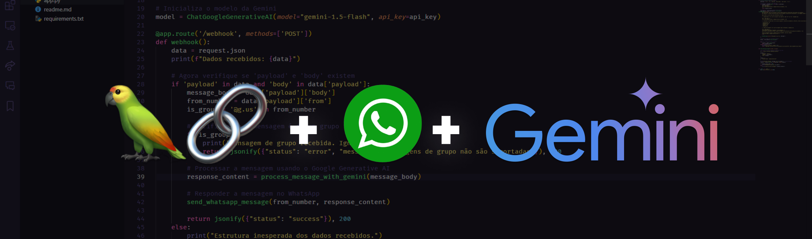

# Integração de Chatbot usando Langchain e WhatsApp via WAHA



## 🚀 Visão Geral

Este projeto consiste em um chatbot integrado ao WhatsApp, desenvolvido com Flask, que utiliza a biblioteca Langchain e a API do WAHA. O objetivo do chatbot é fornecer receitas e dicas culinárias de maneira acessível e rápida, aproveitando a Google Generative AI.

## 🎯 Objetivo do Projeto

A ideia surgiu a partir de um estudo de caso apresentado pela PyCodeBr sobre LLMs e AI.
Então tive a ideia de desenvolver um chatBot que pudesse responder a perguntas sobre receitas e dicas culinárias de maneira acessível e rápida. A implementação foi realizada utilizando a API do WAHA para permitir interações via WhatsApp.

## 💡 Funcionalidades

- **Respostas Automáticas**: O chatbot responde automaticamente a consultas sobre receitas e dicas culinárias.
- **Receitas e Dicas**: Fornece receitas simples e dicas culinárias.
- **Tratamento de Saudações**: Responde a saudações de maneira amigável, incentivando perguntas sobre receitas.
- **Tratamento de Erros**: Responde a perguntas fora do escopo com uma mensagem adequada.

## 📦 Instalação

1. Instalação do WAHA

    Você precisa ter uma instância do WAHA rodando localmente na sua máquina na porta 3000 para o funcionamento do projeto e consumo de todos os endpoints.

    ```bash
    docker run -it -p 3000:3000/tcp devlikeapro/waha
    ```

2. Clone o repositório:

   ```bash
   git clone https://github.com/gu1lh3rm3s0rd1/LLM-Receitas.git
   cd <nome do diretório>
    ```

3. Instale as dependências:

    ```bash
    pip install -r requirements.txt
    ```

4. Crie um arquivo .env na raiz do projeto e adicione sua chave de API do Google, gerada em https://ai.google.dev/ :
   
    ```bash
    GOOGLE_API_KEY=<sua chave de API>
    ```
5. Execute o projeto:

    ```bash
    python app.py
    ```

O servidor irá escutar na porta 5000 e responder a mensagens enviadas para o webhook configurado.

## 📱 Interagindo com o Chatbot

Envie uma mensagem para o número do WhatsApp associado à API do WAHA para interagir com o chatbot.

⚙️Estrutura do Código

O código principal do projeto é estruturado da seguinte forma:

    - Flask: Utilizado para criar o servidor e gerenciar as rotas.
    - Langchain: Usado para gerar respostas baseadas em prompts.
    - Google Generative AI: Integração com o modelo Gemini para gerar receitas e dicas culinárias.